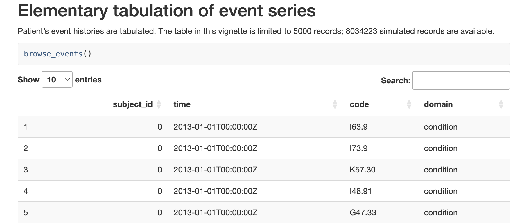
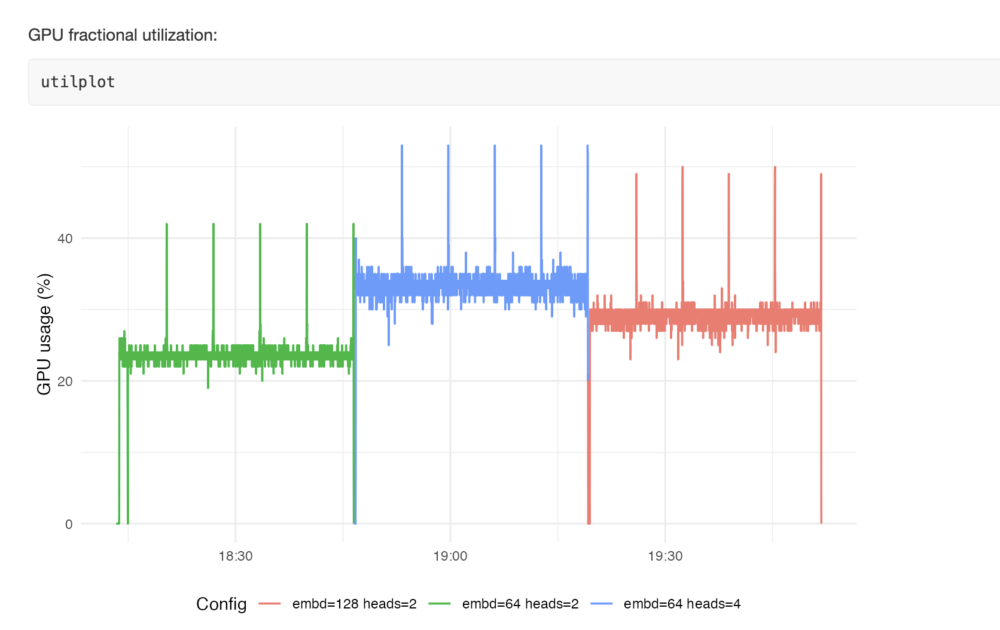

# exploreCEHR

This is an R package for investigating an EHR-based transformer for prediction of health events.

The CEHR-GPT model is described in this [arxiv paper](https://arxiv.org/abs/2402.04400) by Pang
et al.

The associated [github repo](https://github.com/knatarajan-lab/cehrgpt) is the basis for
the materials in this package.

A primary concern of this package is development of tooling for estimating GPU resource
usage needed to train models of this type.

In short, given patient event series like

we want to record the usage of training models with various structures, e.g.:

